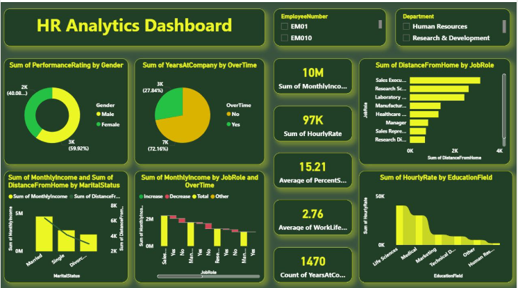

# HR Analytics Dashboard 📊

**Author:** K Haribabu &nbsp;|&nbsp; **Tool:** Microsoft Power BI &nbsp;|&nbsp; **Domain:** People Analytics

---

## Dashboard Preview



---

## Project Overview

Built an interactive Power BI dashboard analysing **1,400+ employee records** to surface key attrition drivers and workforce KPIs for an HR team. The dashboard replaces a manual reporting process with an automated, self-serve tool — enabling HR leadership to monitor performance, satisfaction, and attrition trends without direct data access.

---

## Business Questions Answered

| # | Question | Answer Found |
|---|----------|-------------|
| 1 | What is the total monthly income and hourly rate? | 10M total income · 97K hourly rate |
| 2 | How does overtime affect years at company? | 72.16% No OT (7K yrs) vs 27.84% OT (3K yrs) |
| 3 | Which job role has the highest distance from home? | Sales Executives — highest avg distance |
| 4 | What is the average salary hike? | 15.21% across all employees |
| 5 | What is the average work-life balance score? | 2.76 out of 5 |
| 6 | Which education field has the highest hourly rate? | Life Sciences leads all education fields |
| 7 | How does income vary by marital status? | Married employees report highest monthly income |

---

## Dashboard Features

- **KPI Cards** — Total Monthly Income (10M), Hourly Rate (97K), Avg Salary Hike (15.21%), Work-Life Balance (2.76), Years at Company (1,470)
- **Performance Rating by Gender** — Donut chart showing 59.92% female vs 40.08% male
- **Years at Company by Overtime** — Donut chart comparing OT vs Non-OT employee tenure
- **Distance from Home by Job Role** — Horizontal bar chart ranking all job roles
- **Monthly Income by Job Role and Overtime** — Combo chart with increase, decrease, and total
- **Monthly Income and Distance by Marital Status** — Grouped bar chart across Married, Single, Divorced
- **Hourly Rate by Education Field** — Bar chart comparing Life Sciences, Medical, Marketing, Technical, and HR
- **Interactive Filters** — Slicers for Employee Number (EM01, EM010) and Department (HR, R&D)

---

## Technical Skills Demonstrated

| Skill | Application |
|-------|-------------|
| DAX Measures | Custom KPI calculations: income totals, avg hike, work-life balance score |
| Data Modelling | Relationships built across 1,400+ employee records in Power BI |
| Donut Charts | Gender split and overtime distribution visualised with % labels |
| Bar Charts | Distance by job role, hourly rate by education field |
| Combo Chart | Income trends by job role and overtime (increase/decrease/total) |
| Grouped Bar Chart | Multi-metric comparison across marital status groups |
| Slicers / Filters | Department and employee-level drill-down across all visuals |
| Dashboard Design | Single-page dark-themed layout with consistent green colour palette |

---

## Key Insights

- **72.16%** of employees do not work overtime vs **27.84%** who do — majority maintain standard hours
- **Sales Executives** have the highest distance from home by job role — potential retention risk
- **Life Sciences** leads all education fields in hourly rate — highest-paid qualification background
- **Married employees** report the highest monthly income among all marital status groups
- **Average work-life balance score of 2.76** — indicates room for improvement across departments
- **Average salary hike of 15.21%** — benchmark for compensation planning discussions

---

## Dataset

| Field | Description |
|-------|-------------|
| Records | 1,400+ employee records |
| Key Columns | Employee ID, Age, Department, Job Role, Gender, Marital Status, Monthly Income, Hourly Rate, OverTime, Years at Company, Distance from Home, Work-Life Balance, Percent Salary Hike, Performance Rating, Education Field |
| Source | HR employee attrition dataset |
| Filters Available | Employee Number (EM01, EM010), Department (HR, R&D) |

---

## File Structure

```
hr-analytics-dashboard/
│
├── HR_Analytics_Dashboard.pbix   ← Power BI dashboard file
├── HR_Analytics_Data.csv         ← Raw employee dataset
├── dashboard_preview1.png      ← Dashboard preview image
└── README.md                     ← This file
```
---

## How to Use

1. Download `HR_Analytics_Dashboard.pbix` from this repository
2. Open with **Power BI Desktop** (free download from Microsoft)
3. Use the **slicers** to filter by Employee Number or Department
4. All charts and KPI cards update automatically with each selection

---

## Connect

- **LinkedIn:** [linkedin.com/in/k-haribabu-1160a42bb](https://linkedin.com/in/k-haribabu-1160a42bb)
- **GitHub:** [github.com/Haribabu-89](https://github.com/Haribabu-89)
- **Portfolio:** [haribabu-89.github.io](https://haribabu-89.github.io)
